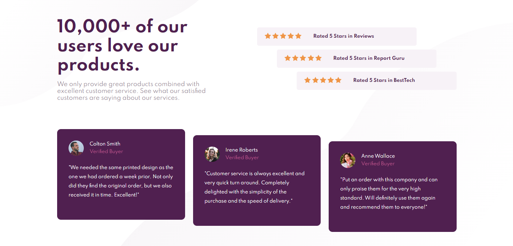

# Frontend Mentor - Social proof section solution

This is a solution to the [Social proof section challenge on Frontend Mentor](https://www.frontendmentor.io/challenges/social-proof-section-6e0qTv_bA). Frontend Mentor challenges help you improve your coding skills by building realistic projects. 

## Table of contents

- [Overview](#overview)
  - [The challenge](#the-challenge)
  - [Screenshot](#screenshot)
  - [Links](#links)
- [My process](#my-process)
  - [Built with](#built-with)
  - [What I learned](#what-i-learned)
- [Author](#author)

## Overview

### The challenge

Users should be able to:

- View the optimal layout for the section depending on their device's screen size

### Screenshot



### Links

- Solution URL: [Github repo](https://github.com/Hade21/social-prof-section-master)
- Live Site URL: [Github page](https://hade21.github.io/social-prof-section-master)

## My process

### Built with

- Semantic HTML5 markup
- CSS custom properties
- Flexbox
- CSS Grid
- Mobile-first workflow

### What I learned


```html
<div class="rated">
          <div class="reviews one">
            <div class="star">
              
              
              
              
              
            </div>
            <p>Rated 5 Stars in Reviews</p>
          </div>
          <div class="reviews two">
            <div class="star">
              
              
              
              
              
            </div>
            <p>Rated 5 Stars in Report Guru</p>
          </div>
          <div class="reviews three">
            <div class="star">
              
              
              
              
              
            </div>
            <p>Rated 5 Stars in BestTech</p>
          </div>
        </div>
        <div class="testimonial">
          <div class="card colton">
            <div class="profile">
              
              <p class="name">Colton Smith</p>
              <p class="status">Verified Buyer</p>
            </div>
            <div class="testi">
              <p class="statement">"We needed the same printed design as the one we had ordered a week prior.
    Not only did they find the original order, but we also received it in time. Excellent!"</p>
            </div>
          </div>
          <div class="card irene">
            <div class="profile">
              
              <p class="name">Irene Roberts </p>
              <p class="status">Verified Buyer</p>
            </div>
            <div class="testi">
              <p class="statement">"Customer service is always excellent and very quick turn around. Completely
                delighted with the simplicity of the purchase and the speed of delivery."</p>
            </div>
          </div>
          <div class="card anne">
            <div class="profile">
              
              <p class="name">Anne Wallace</p>
              <p class="status">Verified Buyer</p>
            </div>
            <div class="testi">
              <p class="statement">"Put an order with this company and can only praise them for the very high
    standard. Will definitely use them again and recommend them to everyone!"</p>
            </div>
          </div>
        </div>
```
```css
.rated{
    height: 100%;
    display: grid;
    grid-template-rows: repeat(14, 7.14%);
    grid-template-columns: repeat(10, 10%);
}
.reviews{
    background-color: hsl(300, 24%, 96%);
    margin: 5px 0;
    padding: 16px 20px;
    display: flex;
    justify-content: left;
    align-items: center;
    border-radius: 5px;
    font-size: 12px;
    font-weight: 700;
    color: hsl(300, 43%, 22%);
    width: initial;
}
.star{
    margin-right: 30px;
}
.one{
    grid-row: 2/5;
    grid-column: 1/9;
}
.two{
    grid-row: 5/8;
    grid-column: 2/10;
}
.three{
    grid-row: 8/11;
    grid-column: 3/11;
}
.testimonial{
    width: 100%;
    height: 100%;
    display: grid;
    grid-template-columns: 32% 2% 32% 2% 32%;
    grid-template-rows: 6% 6% 6% 64% 6% 6% 6%;
    padding-top: 20px;
}
.card{
    width: fit-content;
    background-color: hsl(300, 43%, 22%);
    border-radius: 10px;
    padding: 30px;
    color: hsl(0, 0%, 100%);
    font-size: 12px;
}
.colton{
    grid-column: 1/2;
    grid-row: 1/6;
}
.irene{
    grid-column: 3/4;
    grid-row: 2/7;
}
.anne{
    grid-column: 5/6;
    grid-row: 3/8;
}
.profile{
    display: grid;
    grid-template-columns: 20% 80%;
    grid-template-rows: 50% 50%;
    margin-bottom: 20px;
}
.img-profile{
    border-radius: 50%;
    grid-area: 1/1/3/2;
    width: 40px;
}
.name{
    grid-area: 1/2/2/3;
    align-self: center;
    font-weight: 700;
    padding-left: 10px;
}
.status{
    color: hsl(333, 80%, 67%);
    grid-area: 2/2/3/3;
    align-self: center;
    padding-left: 10px;
    opacity: .8;
}
.testi{
    line-height: 24px;
    /* word-spacing: 1px; */
}
```


## Author

- Frontend Mentor - [@Rohman](https://www.frontendmentor.io/profile/hade21)
- LinkedIn - [Muhammad Abdurrohman](https://www.linkedin.com/in/muhammad-a-589675141/)
